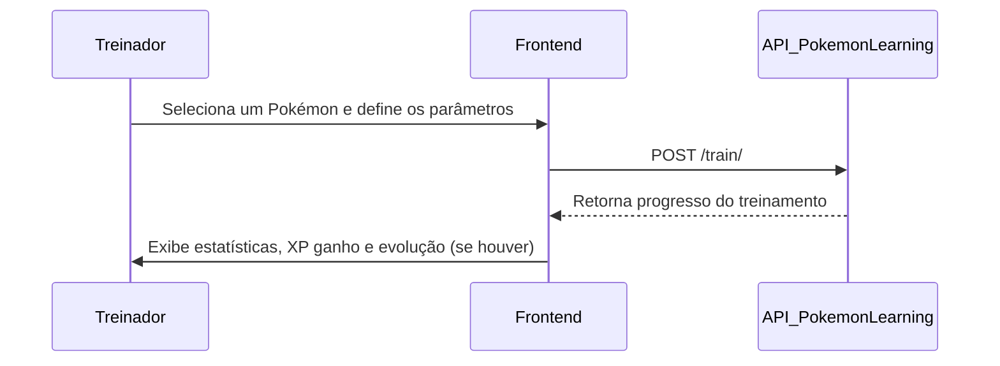

# **Desafio Técnico: Pokémon Learning - Treinando seu Modelo... ou Melhor, seu Pokémon!**

## **Introdução**

O mundo dos treinadores Pokémon está evoluindo! Agora, em vez de simplesmente sair batalhando por aí, os treinadores mais avançados estão adotando **Pokémon Learning** 📊🔥.

Neste desafio, você desenvolverá uma aplicação frontend que **simula um modelo de Machine Learning, mas para treinar Pokémon!** O objetivo é construir uma interface onde os usuários possam selecionar Pokémon, configurar hiperparâmetros de treinamento e acompanhar os resultados ao longo das épocas (batalhas).

Você pode usar qualquer ferramenta disponível (incluindo **ChatGPT**!), mas lembre-se: um bom treinador sabe equilibrar **performance, estratégia e eficiência**.

---

## **Objetivo**

- Criar uma aplicação frontend **em React** que consuma a API de **Pokémon Learning**.
- Permitir que o usuário **selecione um Pokémon e defina os hiperparâmetros do treinamento**, como **número de épocas, taxa de aprendizado e estratégia de otimização**.
- Implementar **paginação e filtros** para explorar os Pokémon disponíveis.
- **Monitorar e visualizar a evolução do treinamento**, incluindo ganho de XP, batalhas travadas e evolução do Pokémon.

Lembre-se: nem todo Pokémon evolui facilmente! Alguns exigem mais XP, enquanto outros podem evoluir rapidamente dependendo da estratégia adotada.

---

## **Como funciona o treinamento?**

Assim como em Machine Learning, um treinamento Pokémon se baseia em:

1️⃣ **Definir os hiperparâmetros**

- Número de **épocas** (quantas rodadas de treino o Pokémon enfrentará).
- **Batch size** (quantas batalhas ocorrem por rodada).
- **Taxa de aprendizado (learning rate)** (quanto XP é ganho por batalha).
- **Estratégia de treinamento (optimizer)**: Ofensivo, defensivo ou equilibrado.

2️⃣ **Rodar o treinamento**  
A API calculará os resultados, considerando os parâmetros escolhidos.

3️⃣ **Monitorar os resultados**  
Após cada época, o XP total será atualizado. Se o Pokémon atingir um **limite de XP**, ele pode **evoluir**!



---

## **Requisitos**

📡 **Base da API:** `https://treinamento.inteligenciadascoisas.com.br/`

| Método | Rota                         | Descrição                                         |
| ------ | ---------------------------- | ------------------------------------------------- |
| `GET`  | `/pokemon?limit=10&offset=0` | Lista Pokémon disponíveis para treino             |
| `GET`  | `/pokemon/{name}/image`      | Retorna a imagem do Pokémon (Base64)              |
| `POST` | `/train/`                    | Inicia um treinamento com os parâmetros definidos |

#### **Exemplo de `POST /train/`**

```json
{
  "pokemon": "pikachu",
  "epochs": 5,
  "batch_size": 3,
  "learning_rate": 0.5,
  "optimizer": "ofensivo",
  "early_stopping": false
}
```

#### **Resposta esperada**

```json
{
  "pokemon": "pikachu",
  "final_pokemon": "raichu",
  "total_xp": 1500,
  "battles": [
    { "epoch": 1, "xp_gained": 300 },
    { "epoch": 2, "xp_gained": 250 }
  ],
  "optimizer": "ofensivo",
  "learning_rate": 0.5
}
```

---

## **O que estamos buscando?**

- **A capacidade do treinador (dev) de consumir a API e exibir os resultados corretamente.**
- **Uma interface organizada e interativa para acompanhar o treinamento.**
- **Filtros e paginação para navegar na Pokédex.**
- **Boas práticas na construção do código e na experiência do usuário.**
- **Criatividade! Quem sabe seu Pokémon Learning não vira o próximo sucesso?** 😃🔥

---

## **Entrega**

- Código hospedado no **GitHub** ou entregue via ZIP.
- Um `INSTRUCTIONS.md` com instruções para rodar o projeto.
- Demonstração funcional (Vercel, Netlify ou localhost).

---

## **Dicas**

- Teste diferentes estratégias de treinamento e veja como os Pokémon evoluem!
- Se puder, adicione **gráficos** para visualizar o ganho de XP.
- Faça o tratamento adequado de erros, porque nem todo treinamento é perfeito!
- Considere **Lazy Loading** para melhorar a performance.

Agora é com você, **treinador!** Boa sorte e que seu Pokémon Learning atinja a **acurácia máxima!** 🚀🔥
