# **Desafio Técnico: Pokémon Learning - Treinando seu Modelo... ou Melhor, seu Pokémon!**

## **Introdução**

O mundo dos treinadores Pokémon está evoluindo! Agora, em vez de simplesmente sair batalhando por aí, os treinadores mais avançados estão adotando **Pokémon Learning** 📊🔥.

Neste desafio, você desenvolverá uma aplicação frontend que **simula um modelo de Machine Learning, mas para treinar Pokémon!** O objetivo é construir uma interface onde os usuários possam selecionar Pokémon, configurar hiperparâmetros de treinamento e acompanhar os resultados ao longo das épocas (batalhas).

Você pode usar qualquer ferramenta disponível (incluindo **ChatGPT**!), mas lembre-se: um bom treinador sabe equilibrar **performance, estratégia e eficiência**.

⏳ **Tempo esperado para o desafio:** **1 hora**, podendo estender no máximo até **1 hora e 30 minutos**.

---

## **Objetivo**

- Criar uma aplicação frontend **em React** que consuma a API de **Pokémon Learning**.
- Permitir que o usuário **selecione um Pokémon e defina os hiperparâmetros do treinamento**, como **número de épocas, taxa de aprendizado e estratégia de otimização**.
- Implementar **paginação e filtros** para explorar os Pokémon disponíveis.
- **Monitorar e visualizar a evolução do treinamento**, incluindo ganho de XP, batalhas travadas e evolução do Pokémon.

Lembre-se: nem todo Pokémon evolui facilmente! Alguns exigem mais XP, enquanto outros podem evoluir rapidamente dependendo da estratégia adotada.

---

## **Requisitos Técnicos**

📌 **React (Node 18 LTS)** – Com TypeScript ou JavaScript, conforme preferir.  
📡 **Base da API:** `https://treinamento.inteligenciadascoisas.com.br/`

| Método | Rota                         | Descrição                                         |
| ------ | ---------------------------- | ------------------------------------------------- |
| `GET`  | `/pokemon?limit=10&offset=0` | Lista Pokémon disponíveis para treino             |
| `GET`  | `/pokemon/{name}/image`      | Retorna a imagem do Pokémon (Base64)              |
| `POST` | `/train/`                    | Inicia um treinamento com os parâmetros definidos |

---

## **Como funciona o treinamento?**

Assim como em **Machine Learning**, um treinamento Pokémon segue um fluxo bem definido:

1️⃣ **Definir os hiperparâmetros**

- **Número de épocas**: Quantas rodadas de treino o Pokémon enfrentará.
- **Batch size**: Quantas batalhas ocorrem por rodada.
- **Taxa de aprendizado (learning rate)**: Quanto XP é ganho por batalha.
- **Estratégia de treinamento (optimizer)**: Ofensivo, defensivo ou equilibrado.

2️⃣ **Rodar o treinamento**  
A API calculará os resultados com base nos parâmetros escolhidos, retornando o **XP ganho, as batalhas registradas e possíveis evoluções**.

3️⃣ **Monitorar os resultados**  
Após cada época, o XP total será atualizado. Se o Pokémon atingir um **limite de XP**, ele pode **evoluir**!

---

## **Fluxo da API**

A API de treinamento de Pokémon **consulta a PokéAPI** para obter informações sobre os Pokémon e processa os cálculos internamente para retornar os resultados do treinamento.

```mermaid
sequenceDiagram
    participant Treinador
    participant Frontend
    participant TreinamentoPokeLearning
    participant PokéAPI

    Treinador->>Frontend: Abre a aplicação
    Frontend->>TreinamentoPokeLearning: GET /pokemon?limit=10
    TreinamentoPokeLearning->>PokéAPI: GET /pokemon?limit=10
    PokéAPI-->>TreinamentoPokeLearning: Retorna lista de Pokémon
    TreinamentoPokeLearning-->>Frontend: Retorna lista paginada de Pokémon
    Frontend->>Treinador: Exibe lista de Pokémon com imagens

    Treinador->>Frontend: Seleciona um Pokémon para treinar
    Frontend->>TreinamentoPokeLearning: POST /train/
    TreinamentoPokeLearning->>PokéAPI: GET /pokemon/{name}
    PokéAPI-->>TreinamentoPokeLearning: Retorna dados do Pokémon
    TreinamentoPokeLearning->>PokéAPI: GET /pokemon-species/{name}
    PokéAPI-->>TreinamentoPokeLearning: Retorna informações de evolução
    TreinamentoPokeLearning-->>Frontend: Retorna progresso do treinamento
    Frontend->>Treinador: Exibe estatísticas, XP ganho e evolução (se houver)
```



---

## **Exemplo de Requisição `POST /train/`**

```json
{
  "pokemon": "pikachu",
  "epochs": 5,
  "batch_size": 3,
  "learning_rate": 0.5,
  "optimizer": "ofensivo",
  "early_stopping": false
}
```

#### **Resposta esperada**

```json
{
  "pokemon": "pikachu",
  "final_pokemon": "raichu",
  "total_xp": 1500,
  "battles": [
    { "epoch": 1, "xp_gained": 300 },
    { "epoch": 2, "xp_gained": 250 }
  ],
  "optimizer": "ofensivo",
  "learning_rate": 0.5
}
```

---

## **O que estamos buscando?**

- **A capacidade do treinador (dev) de consumir a API e exibir os resultados corretamente.**
- **Uma interface organizada e interativa para acompanhar o treinamento.**
- **Filtros e paginação para navegar na Pokédex.**
- **Boas práticas na construção do código e na experiência do usuário.**
- **Atenção a detalhes técnicos, como ambiente de desenvolvimento.**
- **Criatividade! Quem sabe seu Pokémon Learning não vira o próximo sucesso?** 😃🔥

---

## **Entrega**

- Código-fonte a partir de um **pull request de um fork deste repositório**.
- Arquivo `INSTRUCTIONS.md` com **instruções para rodar a aplicação**.
- Explicação rápida sobre as **escolhas feitas no desenvolvimento**.

---

## **Dicas**

- Teste diferentes estratégias de treinamento e veja como os Pokémon evoluem!
- Se puder, adicione **gráficos** para visualizar o ganho de XP.
- Faça o tratamento adequado de erros, porque nem todo treinamento é perfeito!
- Considere **Lazy Loading** para melhorar a performance.

Agora é com você, **treinador!** Boa sorte e que seu Pokémon Learning atinja a **acurácia máxima!** 🚀🔥
